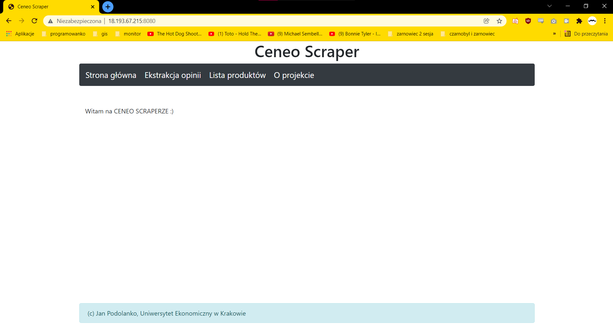

# instalacja
1. wejscie na serwer ssh 201075@sokrates.edu.jkan.pl
2. umieszczenie tam plikow z repo
3. "eval \`ssh-agent\`" w terminalu
4. "ssh ec2-user@<ip_maszyny> -i id_student" dla obu adresow ip
5. "ssh-add id_student"
6. "ansible-playbook -i hosts.ini scrapper.yaml -e DB_PW='hasło'" wlaczenie samej aplikacji

