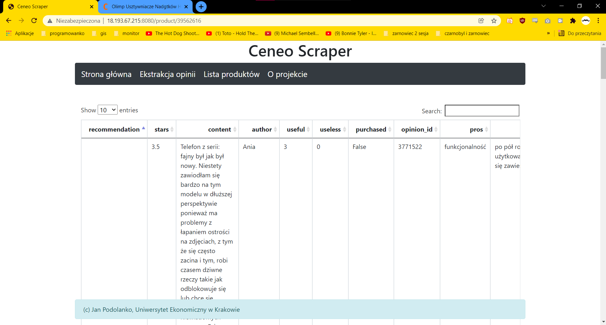

# Instalacja
1. Stworzenie dwóch instancji maszyn na AWS
2. Wejście na serwer ssh 201075@sokrates.edu.jkan.pl
3. Umieszczenie tam plikow z repo
4. Wpisanie w terminal "eval \`ssh-agent\`"
5. "ssh ec2-user@<ip_maszyny> -i id_student" dla adresow ip obu maszyn z AWS
6. "ssh-add id_student"
7. "ansible-playbook -i hosts.ini scrapper.yaml -e DB_PW='hasło'" -Zainicjowanie samej aplikacji

